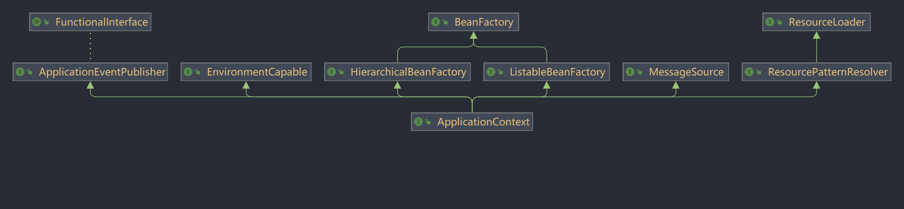
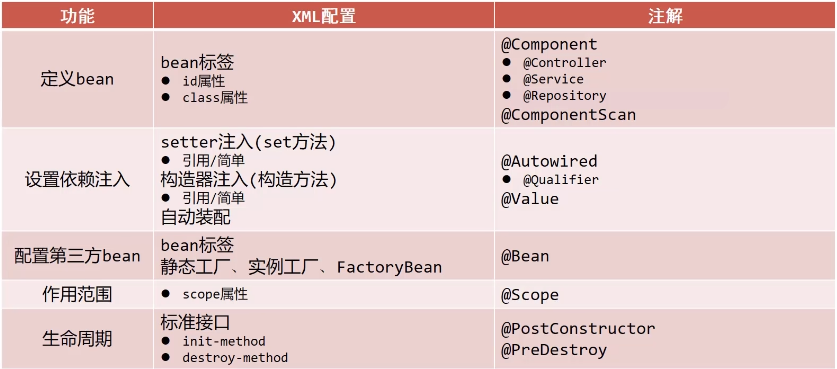
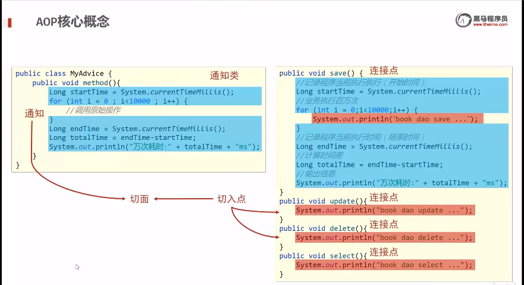
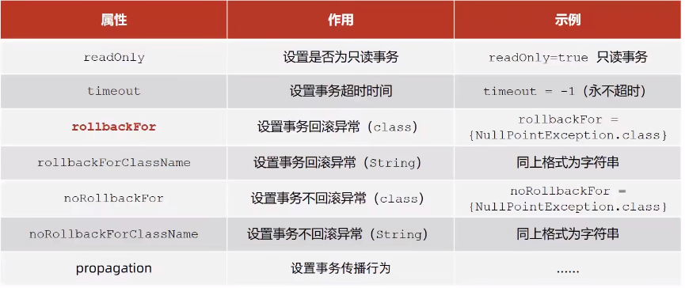
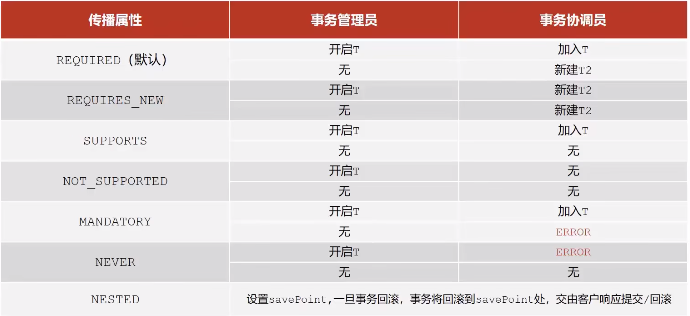
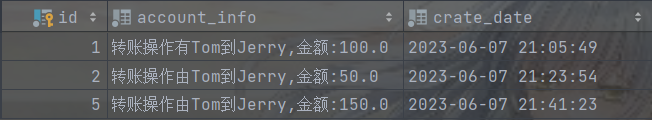

<!-- TOC -->
* [一. Spring系统架构](#一-spring系统架构)
* [二. IoC思想和DI(依赖注入) 目标: 充分解耦](#二-ioc思想和di依赖注入-目标-充分解耦)
  * [1. IoC思想 --- (Inversion of Control)控制反转](#1-ioc思想-----inversion-of-control控制反转)
  * [2. DI(依赖注入)](#2-di依赖注入)
  * [3. IoC 获取方法](#3-ioc-获取方法)
* [三. bean配置](#三-bean配置)
  * [1. bean基础配置:](#1-bean基础配置)
  * [2. bean的别名:](#2-bean的别名)
  * [3. bean的作用范围:](#3-bean的作用范围)
  * [4. bean的实例化](#4-bean的实例化)
  * [5. bean的生命周期](#5-bean的生命周期)
    * [详细生命周期](#详细生命周期)
* [四. 依赖注入方式](#四-依赖注入方式)
  * [1. setter注入](#1-setter注入)
  * [2. 构造器注入](#2-构造器注入)
  * [3. 依赖注入方式选择](#3-依赖注入方式选择)
  * [4. 依赖自动装配](#4-依赖自动装配)
  * [5. 集合注入](#5-集合注入)
* [五. 数据源对象管理(第三方资源配置管理)](#五-数据源对象管理第三方资源配置管理)
  * [1. 以阿里巴巴的druid数据源导入为例:](#1-以阿里巴巴的druid数据源导入为例)
  * [2. 以c3p0数据源导入为例](#2-以c3p0数据源导入为例)
  * [3. 加载Properties文件形式开启数据源(对druid源修改)](#3-加载properties文件形式开启数据源对druid源修改)
* [六. 容器](#六-容器)
  * [1. 创建容器](#1-创建容器)
  * [2. 获取bean](#2-获取bean)
  * [3. 容器类层次结构](#3-容器类层次结构)
  * [4. BeanFactory](#4-beanfactory)
* [七. 注解开发](#七-注解开发)
  * [1. 注解开发定义bean](#1-注解开发定义bean)
  * [2. 纯注解开发](#2-纯注解开发)
  * [3. 注解开发bean的作用范围](#3-注解开发bean的作用范围)
  * [4. 注解开发bean的生命周期](#4-注解开发bean的生命周期)
  * [5. 注解开发bean的注入依赖](#5-注解开发bean的注入依赖)
    * [(1).复杂属性注解自动装配:](#1复杂属性注解自动装配)
    * [(2). 简单属性注解自动装配](#2-简单属性注解自动装配)
  * [6. 注解开发bean管理第三方bean](#6-注解开发bean管理第三方bean)
    * [(1). 第三方bean管理](#1-第三方bean管理)
    * [(2). 第三方bean依赖注入](#2-第三方bean依赖注入)
  * [7. XML配置对比注解配置](#7-xml配置对比注解配置)
* [八. spring整合mybatis和junit](#八-spring整合mybatis和junit)
  * [1. spring整合mybatis](#1-spring整合mybatis)
  * [2. spring整合junit](#2-spring整合junit)
* [九. Spring-AOP](#九-spring-aop)
  * [1. AOP简介](#1-aop简介)
  * [2. AOP核心概念](#2-aop核心概念)
  * [3. AOP入门案例](#3-aop入门案例)
  * [4. AOP工作流程](#4-aop工作流程)
  * [5. AOP切入点表达式](#5-aop切入点表达式)
    * [(1). 语法格式](#1-语法格式)
    * [(2). 通配符](#2-通配符)
    * [(3). 书写技巧](#3-书写技巧)
  * [6. AOP通知类型](#6-aop通知类型)
  * [7. AOP通知获取数据](#7-aop通知获取数据)
    * [(1). 获取参数](#1-获取参数)
    * [(2). 获取返回值](#2-获取返回值)
    * [(3). 获取异常](#3-获取异常)
* [十. Spring事务](#十-spring事务)
  * [1. Spring事务简介](#1-spring事务简介)
  * [2. 案例: 银行账户转账](#2-案例-银行账户转账)
    * [(1). 开启事务之添加Spring事务管理](#1-开启事务之添加spring事务管理)
    * [(2). 开启事务之设置事务管理器](#2-开启事务之设置事务管理器)
    * [(3). 开启事务之设注解事务驱动](#3-开启事务之设注解事务驱动enabletransactionmanagement)
  * [3. Spring事务原理 --- 事务角色](#3-spring事务原理-----事务角色)
    * [(1). 事务管理员](#1-事务管理员)
    * [(2). 事务协调员](#2-事务协调员)
  * [4. Spring事务属性](#4-spring事务属性)
    * [(1). 事务配置](#1-事务配置)
    * [(2). 案例: 转账业务追加日志](#2-案例-转账业务追加日志)
    * [(3). 事务传播行为](#3-事务传播行为)
<!-- TOC -->

# 一. Spring系统架构

1. Core Container: 核心容器 --- Beans Core Context SpEL
2. Data Access: 数据访问/Data Integration: 数据集成
3. AOP: 面向切面编程
4. Aspects: AOP思想实现
5. Transactions: 事务  (归于Data Access里)
6. Web: Web开发
7. Test: 单元测试与集成测试

# 二. IoC思想和DI(依赖注入) 目标: 充分解耦

## 1. IoC思想 --- (Inversion of Control)控制反转

对象的创建控制权由程序转移到外部
使用对象时, 程序不要主动使用new产生对象, 转换为由外部提供对象
Spring技术对Ioc思想进行了思想, 提供了一个IoC容器, 用来充当IoC思想的外部
IoC容器负责对象的创建, 初始化等一系列工作, 被创建或被管理的对象在IoC容器中统称为Bean

## 2. DI(依赖注入)

在容器中建立bean与bean之间的依赖关系的整个过程

最终效果: 使用对象时不仅可以直接从IoC容器中获取, 并且获取到的bean已经绑定了所有的依赖关系

## 3. IoC 获取方法

**配置**
**接口**
**接口方法**

# 三. bean配置

## 1. bean基础配置:

- bean标签表示配置bean
- id属性表示给bean起名字
- class属性表示给bean定义类型
- id不能重复

```xml

<bean id="bookDao" class="com.itstudy.dao.impl.BookDaoImpl"/>

<bean id="bookService" class="com.itstudy.service.impl.BookServiceImpl"/>
```

## 2. bean的别名:

通过bean标签的name属性可以起多个别名

```xml
    <bean id="bookService" name="service service01" class="com.itstudy.service.impl.BookServiceImpl"/>
```

## 3. bean的作用范围:

spring创造出的对象是单例的, 对象只有一个

```java
class App {
    public static void main(String[] args) {
        ApplicationContext ctx = new ClassPathXmlApplicationContext("applicationContext.xml");
        BookService bookService1 = (BookService) ctx.getBean("bookService");
        BookService bookService2 = (BookService) ctx.getBean("bookService");
        System.out.println(bookService1); //@865dd6
        System.out.println(bookService2); //@865dd6
    }
}
```

通过修改bean的scope属性 scope="prototype" 可以产生不同的对象@4da4253

```xml

<bean id="bookDao" class="com.itstudy.dao.impl.BookDaoImpl" scope="prototype"/>
```

为什么bean默认为单例呢?

- 多次创造对象会造成业务逻辑复杂, 对内存造成压力
- 单例适合业务运行时多次从容器里拿出同一bean对象, 用完就放回去, 减少内存的运行压力

**适合交给容器管理的bean**

- 表现层对象
- 业务层对象
- 数据层对象
- 工具对象

**不适合交给容器管理的bean**

- 封装实体的域对象

## 4. bean的实例化

(1) bean本质上是对象, spring内部通过反射来构造对应的bean对象, 如果bean对象只有有参构造方法,
spring构造会报BeanCreateException

- spring采用的是通过反射进行的无参构造
- 解决spring异常从异常底部开始解决, 大部分情况解决最底下的异常就能解决

(2)bean实例化--静态工厂

- 实例化工厂时必须实例化它的方法

```xml
<!--方法二: 使用静态工厂实例化bean-->
<bean id="orderDao" class="com.itstudy.factory.OrderDaoFactory" factory-method="getOrderDao"/>
```

(3)bean实例化--实例工厂

- 先实现实例工厂对象, 再实现实例工厂里的方法

```xml
<!--方法三: 使用实例工厂实例化bean-->
<bean id="userFactory" class="com.itstudy.factory.UseDaoFactory"/>
        <!--userFactory完全是配合使用, 实际无意义-->
<bean id="userDao" factory-bean="userFactory" factory-method="getUserDao"/>
- ```

(4)针对(3)实现的简单方法

- 新建一个UserDaoFactoryBean继承接口FactoryBean<T>, T为你要实现的类型

```java
public class UserDaoFactoryBean implements FactoryBean<UserDao> {
    //代替原始实例工厂中创建对象的方法
    @Override
    public UserDao getObject() throws Exception {
        return new UserDaoImpl();
    }
    //返回你要创造类的类型字节码class(一般接口的class)
    @Override
    public Class<?> getObjectType() {
        return UserDao.class;
    }
}
```

- 然后在application中配置一个Factory的bean就行

```xml
<!--方法四(方法三的变种)-->
<bean id="userDao" class="com.itstudy.factory.UserDaoFactoryBean"/>
```

- 实际新建出来的对象是getobject方法里实现出来的对象, 非工厂对象, FactoryBean是后期非常常用的一种构建bean的方法

## 5. bean的生命周期

- 生命周期: 从创建到消亡的过程
- bean生命周期: bean从创建到消亡的过程
- bean生命周期控制: 在bean创建后到销毁前做一些事情, 例如在bean创建之前进行数据的准备

(1)实现方式: 写好对应的初始化和销毁方法, 然后在配置文件中进行配置

```xml

<bean id="bookDao" class="com.itstudy.dao.impl.BookDaoImpl" init-method="init" destroy-method="destroy"/>
```

ClassPathXmlApplicationContext里存在暴力关闭的方法close(),建议采用关闭钩子的方法registerShutdownHook();后期web工程会应用到
这些方法均来自于ConfigurableApplicationContext接口

(2)spring提供的接口InitializingBean, DisposableBean里的方法,分别重写下面两个方法

```java
public class BookServiceImpl implements BookService, InitializingBean, DisposableBean {
    @Override
    public void destroy() throws Exception {
        System.out.println("service destroy");
    }

    @Override
    public void afterPropertiesSet() throws Exception {
        System.out.println("service init");
    }
}
```

配置好service bean对象后直接使用(不需要配init-method 和 destroy-method)

### 详细生命周期

1. 初始化容器

* 创建对象(内存分配)
* 执行构造方法
* 执行属性注入(set操作)
* 执行bean初始化方法

2. 使用bean

* 执行业务操作

3. 关闭/销毁容器

* 执行bean销毁方法

# 四. 依赖注入方式

1. 思考: 像一个类中传递数据的方式有几种?

* 普通方法(set方法)
* 构造方法

2. 思考: 依赖注入描述了在容器中建立了bean与bean之间依赖关系的过程, 如果bean运行需要的是数字或字符串呢?

* 引用类型
* 简单类型(基本类型与String)

3. 依赖注入方式:

- setter注入
    * 简单类型
    * 引用类型
- 构造器注入
    * 简单类型
    * 引用类型

## 1. setter注入

先编写好class类

```java
public class BookDaoImpl implements BookDao{
    private int connectionNum;
    private String databaseName;

    public void setConnectionNum(int connectionNum) {
        this.connectionNum = connectionNum;
    }

    public void setDatabaseName(String databaseName) {
        this.databaseName = databaseName;
    }

    @Override
    public void save() {
        System.out.println("book dao save..." + databaseName + ", " + connectionNum);
    }
}
```

再在配置文件里配置bean

```xml

<bean id="bookDao" class="com.itstudy.dao.impl.BookDaoImpl">
    <property name="databaseName" value="mysql"/>
    <property name="connectionNum" value="10"/>
</bean>
```

最后通过获取容器进行程序运行

```java
import com.itstudy.dao.BookDao;

public class AppForDISet {
  public static void main(String[] args) {
    ClassPathXmlApplicationContext ctx = new ClassPathXmlApplicationContext("applicationContext.xml");
    BookDao bookDao = (BookDao) ctx.getBean("bookDao");
    bookDao.save();
  }
}
```

运行结果:

```
book dao save...mysql, 10
```

## 2. 构造器注入

编写class类

```java
public class BookServiceImpl implements BookService {

    private BookDao bookDao;

    public BookServiceImpl(BookDao bookDao) {
        this.bookDao = bookDao;
    }

    @Override
    public void save() {
        System.out.println("book service save...");
        bookDao.save();
    }
}
```

配置bean属性, 绑定构造器的使用 constructor-arg 标签, 绑定setter的使用 property 标签

```xml
    <bean id="bookDao" class="com.itstudy.dao.impl.BookDaoImpl"/>

    <bean id="bookService" class="com.itstudy.service.impl.BookServiceImpl">
        <constructor-arg name="bookDao" ref="bookDao"/>
    </bean>
```

ref链接的是 bean id="bookDao", name链接的是 private BookDao bookDao;

简单类型的注入类似, 只展示xml文件

```xml

<bean id="bookDao" class="com.itstudy.dao.impl.BookDaoImpl">
    <constructor-arg name="databaseName" value="mysql"/>
    <constructor-arg name="connectionNum" value="666"/>
</bean>
```

结果如下:

```
book service save...
book dao save...mysql, 666
User Dao save...
```

但是上面的这种写法在类型名称变化时配置文件也要更改bean的name属性, 耦合度大, 所以还有一种解耦方式的写法, 就是利用参数的类型type来配置

```xml

<bean id="bookDao" class="com.itstudy.dao.impl.BookDaoImpl">
    <constructor-arg type="java.lang.String" value="mysql"/>
    <constructor-arg type="int" value="666"/>
</bean>

<bean id="userDao" class="com.itstudy.dao.impl.UserDaoImpl"/>

<bean id="bookService" class="com.itstudy.service.impl.BookServiceImpl">
<constructor-arg type="com.itstudy.dao.BookDao" ref="bookDao"/>
<constructor-arg type="com.itstudy.dao.UserDao" ref="userDao"/>
</bean>
```

但是这种写法还是有弊端, 在多个相同类型的参数下无效, 究极方式就是利用构造器中的参数顺序来辨别

```xml

<bean id="bookDao" class="com.itstudy.dao.impl.BookDaoImpl">
    <constructor-arg index="0" value="666"/>
    <constructor-arg index="1" value="mysql"/>
</bean>

<bean id="userDao" class="com.itstudy.dao.impl.UserDaoImpl"/>

<bean id="bookService" class="com.itstudy.service.impl.BookServiceImpl">
<constructor-arg index="0" ref="bookDao"/>
<constructor-arg index="1" ref="userDao"/>
</bean>
```

以上各种方式运行的结果在简单基础上都一样, 复杂的参数可能只有利用参数顺序的方式才能实现

## 3. 依赖注入方式选择

1. 强制依赖使用构造器进行，使用setter注入有概率不进行注入导致null对象出现
    * 强制依赖指对象在创建的过程中必须要注入指定的参数
2. 可选依赖使用setter注入进行，灵活性强
    * 可选依赖指对象在创建过程中注入的参数可有可无
3. Spring框架倡导使用构造器，第三方框架内部大多数采用构造器注入的形式进行数据初始化，相对严谨
4. 如果有必要可以两者同时使用，使用构造器注入完成强制依赖的注入，使用setter注入完成可选依赖的注入
5. 实际开发过程中还要根据实际情况分析，如果受控对象没有提供setter方法就必须使用构造器注入
6. **"自己开发的模块推荐使用setter注入"**

## 4. 依赖自动装配

IoC容器根据bean所依赖的资源在容器中自动查找并注入到bean中的过程称为自动装配

自动装配的方式

- 按类型(常用)
- 按名称
- 按构造方法
- 不启用自动装配

只需要更改xml配置文件, 改个autowire属性

```xml

<bean id="bookDao" class="com.itstudy.dao.impl.BookDaoImpl"/>

<bean id="bookService" name="service service2 serviceEBI" class="com.itstudy.service.impl.BookServiceImpl"
      autowire="byType"/>
```

按类型装配依赖的那个bean的id都可以不写

**依赖自动装配的特征**

1. 自动装配用于引用类型依赖注入，不能对简单类型进行操作
2. 使用按类型装配时（byType）必须保障容器中相同类型的bean唯一，推荐使用
3. 使用按名称装配时（byName）必须保障容器中具有指定名称的bean，因变量名与配置耦合，不推荐使用
4. 自动装配优先级低于setter注入与构造器注入，同时出现时自动装配配置失效

## 5. 集合注入

class文件编写:

```java
public class BookDaoImpl implements BookDao {
    private int[] array;
    private List<String> list;
    private Set<String> set;
    private Map<String, String> map;
    private Properties properties;

    public void setArray(int[] array) {
        this.array = array;
    }

    public void setList(List<String> list) {
        this.list = list;
    }

    public void setSet(Set<String> set) {
        this.set = set;
    }

    public void setMap(Map<String, String> map) {
        this.map = map;
    }

    public void setProperties(Properties properties) {
        this.properties = properties;
    }

    @Override
    public void save() {
        System.out.println("book dao save...");

        System.out.println("遍历数组" + Arrays.toString(array));
        System.out.println("遍历List" + list);
        System.out.println("遍历Set" + set);
        System.out.println("遍历Map" + map);
        System.out.println("遍历Properties" + properties);
    }
}
```

xml文件配置:

```xml

<bean id="bookDao" class="com.itstudy.dao.impl.BookDaoImpl">
    <property name="array">
        <array>
            <value>100</value>
            <value>200</value>
            <value>300</value>
        </array>
    </property>
    <property name="list">
        <list>
            <value>tom</value>
            <value>alen</value>
            <value>jack</value>
        </list>
    </property>
    <property name="set">
        <set>
            <value>tom</value>
            <value>alen</value>
            <value>jack</value>
            <value>jack</value>
        </set>
    </property>
    <property name="map">
        <map>
            <entry key="tom" value="上海"/>
            <entry key="alen" value="北京"/>
            <entry key="jack" value="广州"/>
        </map>
    </property>
    <property name="properties">
        <props>
            <prop key="country">china</prop>
            <prop key="province">jiangsu</prop>
            <prop key="city">nanjing</prop>
        </props>
    </property>
</bean>
```

运行结果:

```
book dao save...
遍历数组[100, 200, 300]
遍历List[tom, alen, jack]
遍历Set[tom, alen, jack]
遍历Map{tom=上海, alen=北京, jack=广州}
遍历Properties{country=china, province=jiangsu, city=nanjing}
```

# 五. 数据源对象管理(第三方资源配置管理)

## 1. 以阿里巴巴的druid数据源导入为例:

首先导入阿里云的druid数据源, 配置pom.xml

```xml

<dependency>
    <groupId>com.alibaba</groupId>
    <artifactId>druid</artifactId>
    <version>1.2.18</version>
</dependency>
```

编写class文件

```java
public class App {
    public static void main(String[] args) {
        ApplicationContext ctx = new ClassPathXmlApplicationContext("applicationContext.xml");
        DataSource dataSource = (DataSource) ctx.getBean("dataSource");
        System.out.println(dataSource);
    }
}
```

配置applicationContext.xml

```xml
<!--管理DruidDataSource对象-->
<bean id="dataSource" class="com.alibaba.druid.pool.DruidDataSource">
    <property name="driverClassName" value="com.mysql.jdbc.Driver"/>
    <property name="url" value="jdbc:mysql://localhost:3306/Mydatabase"/>
    <property name="username" value="root"/>
    <property name="password" value="root"/>
</bean>
```

结果:

```
{
	CreateTime:"2023-06-02 16:34:48",
	ActiveCount:0,
	PoolingCount:0,
	CreateCount:0,
	DestroyCount:0,
	CloseCount:0,
	ConnectCount:0,
	Connections:[
	]
}
```

## 2. 以c3p0数据源导入为例

首先导入c3p0数据源, 配置pom.xml

```xml

<dependency>
    <groupId>c3p0</groupId>
    <artifactId>c3p0</artifactId>
    <version>0.9.1.2</version>
</dependency>
```

编写class文件

```java
public class App {
    public static void main(String[] args) {
        ApplicationContext ctx = new ClassPathXmlApplicationContext("applicationContext.xml");
        DataSource dataSource = (DataSource) ctx.getBean("dataSource");
        System.out.println(dataSource);
    }
}
```

配置applicationContext.xml

```xml
<!--c3p0数据源-->
<bean id="dataSource" class="com.mchange.v2.c3p0.ComboPooledDataSource">
    <property name="driverClass" value="com.mysql.jdbc.Driver"/>
    <property name="jdbcUrl" value="jdbc:mysql://localhost:3306/Mydatabase"/>
    <property name="user" value="root"/>
    <property name="password" value="root"/>
</bean>
```

运行前导入下jdbc的坐标

```xml

<dependency>
    <groupId>mysql</groupId>
    <artifactId>mysql-connector-java</artifactId>
    <version>8.0.28</version>
</dependency>

```

结果:

```
6月 02, 2023 4:48:29 下午 com.mchange.v2.log.MLog <clinit>
信息: MLog clients using java 1.4+ standard logging.
6月 02, 2023 4:48:30 下午 com.mchange.v2.c3p0.C3P0Registry banner
信息: Initializing c3p0-0.9.1.2 [built 21-May-2007 15:04:56; debug? true; trace: 10]
6月 02, 2023 4:48:30 下午 com.mchange.v2.c3p0.impl.AbstractPoolBackedDataSource getPoolManager
信息: Initializing c3p0 pool... com.mchange.v2.c3p0.ComboPooledDataSource [ acquireIncrement -> 3, acquireRetryAttempts -> 30, acquireRetryDelay -> 1000, autoCommitOnClose -> false, automaticTestTable -> null, breakAfterAcquireFailure -> false, checkoutTimeout -> 0, connectionCustomizerClassName -> null, connectionTesterClassName -> com.mchange.v2.c3p0.impl.DefaultConnectionTester, dataSourceName -> 1b618bzawy7jrdatws626|59af0466, debugUnreturnedConnectionStackTraces -> false, description -> null, driverClass -> com.mysql.jdbc.Driver, factoryClassLocation -> null, forceIgnoreUnresolvedTransactions -> false, identityToken -> 1b618bzawy7jrdatws626|59af0466, idleConnectionTestPeriod -> 0, initialPoolSize -> 3, jdbcUrl -> jdbc:mysql://localhost:3306/Mydatabase, maxAdministrativeTaskTime -> 0, maxConnectionAge -> 0, maxIdleTime -> 0, maxIdleTimeExcessConnections -> 0, maxPoolSize -> 15, maxStatements -> 0, maxStatementsPerConnection -> 0, minPoolSize -> 3, numHelperThreads -> 3, numThreadsAwaitingCheckoutDefaultUser -> 0, preferredTestQuery -> null, properties -> {password=******, user=******}, propertyCycle -> 0, testConnectionOnCheckin -> false, testConnectionOnCheckout -> false, unreturnedConnectionTimeout -> 0, usesTraditionalReflectiveProxies -> false ]
com.mchange.v2.c3p0.ComboPooledDataSource [ acquireIncrement -> 3, acquireRetryAttempts -> 30, acquireRetryDelay -> 1000, autoCommitOnClose -> false, automaticTestTable -> null, breakAfterAcquireFailure -> false, checkoutTimeout -> 0, connectionCustomizerClassName -> null, connectionTesterClassName -> com.mchange.v2.c3p0.impl.DefaultConnectionTester, dataSourceName -> 1b618bzawy7jrdatws626|59af0466, debugUnreturnedConnectionStackTraces -> false, description -> null, driverClass -> com.mysql.jdbc.Driver, factoryClassLocation -> null, forceIgnoreUnresolvedTransactions -> false, identityToken -> 1b618bzawy7jrdatws626|59af0466, idleConnectionTestPeriod -> 0, initialPoolSize -> 3, jdbcUrl -> jdbc:mysql://localhost:3306/Mydatabase, maxAdministrativeTaskTime -> 0, maxConnectionAge -> 0, maxIdleTime -> 0, maxIdleTimeExcessConnections -> 0, maxPoolSize -> 15, maxStatements -> 0, maxStatementsPerConnection -> 0, minPoolSize -> 3, numHelperThreads -> 3, numThreadsAwaitingCheckoutDefaultUser -> 0, preferredTestQuery -> null, properties -> {password=******, user=******}, propertyCycle -> 0, testConnectionOnCheckin -> false, testConnectionOnCheckout -> false, unreturnedConnectionTimeout -> 0, usesTraditionalReflectiveProxies -> false ]

```

## 3. 加载Properties文件形式开启数据源(对druid源修改)

新建jdbc.Properties文件

```properties
jdbc.driver=com.mysql.jdbc.Driver
jdbc.username=root
jdbc.password=root
jdbc.url=jdbc:mysql://localhost:3306/Mydatabase
```

配置applicationContext.xml文件, 同时要开一个新的spring命名空间context

```xml
<?xml version="1.0" encoding="UTF-8"?>
<beans xmlns="http://www.springframework.org/schema/beans"
       xmlns:xsi="http://www.w3.org/2001/XMLSchema-instance"
       xmlns:context="http://www.springframework.org/schema/context"

       xsi:schemaLocation="
       http://www.springframework.org/schema/beans
       http://www.springframework.org/schema/beans/spring-beans.xsd
       http://www.springframework.org/schema/context
       http://www.springframework.org/schema/context/spring-context.xsd">

    <!--加载jdbc配置文件的形式-->
    <!--1, 开启context命名空间-->
    <!--2, 使用context命名空间加载jdbc.properties文件-->
    <!--注意: system-properties-mode="NEVER"表示不加载系统的环境变量-->
    <!--加载多个 location="jdbc.properties, jdbc2.properties" 或者 location="*.properties"-->
    <!--最专业的写法 location="classpath:*.properties"-->
    <!--加载类路径或者jar包里的配置文件写法 location="classpath*:*.properties" 加载块里全部的配置文件-->
    <context:property-placeholder location="classpath*:*.properties" system-properties-mode="NEVER"/>

    <bean id="dataSource" class="com.alibaba.druid.pool.DruidDataSource">
        <property name="driverClassName" value="${jdbc.driver}"/>
        <property name="url" value="${jdbc.url}"/>
        <property name="username" value="${jdbc.username}"/>
        <property name="password" value="${jdbc.password}"/>
    </bean>


</beans>
```

# 六. 容器

## 1. 创建容器

```
//1. 加载类路径下的配置文件
ApplicationContext ctx = new ClassPathXmlApplicationContext("applicationContext.xml");
//2. 绝对路径或者相对路径下的配置文件
ApplicationContext ctx2 = new FileSystemXmlApplicationContext("SpringDemo09\\src\\main\\resources\\applicationContext.xml");
  
```

## 2. 获取bean

```
//1, 强转类型获取容器
BookService bookService = (BookService) ctx.getBean("bookService");
//2, 附加文件类型字节码文件获取bean
BookService bookService2 = ctx2.getBean("bookService", BookService.class);
//3, 直接指定文件类型字节码文件获取bean, 局限性在于只能由一个BookService类型的容器
BookService bookService3 = ctx2.getBean(BookService.class);
```

## 3. 容器类层次结构



## 4. BeanFactory

```java
public class AppForBeanFactory {
    public static void main(String[] args) {
        Resource resources = new ClassPathResource("applicationContext.xml");
        BeanFactory bf = new XmlBeanFactory(resources);
        BookDao bookDao = bf.getBean(BookDao.class);
        bookDao.save();
    }
}
```

BeanFactory在初始化的bean时有延迟加载构造器的特性, 而ApplicationContext初始化bean是立即加载构造器,
也可以通过修改bean属性的 lazy-init="true" 来实现延迟加载

# 七. 注解开发

## 1. 注解开发定义bean

使用@Component定义bean, public class上方定义,可以写bean的名称也可以不写

```java
@Component("bookDao")
public class BookDaoImpl implements BookDao{

    @Override
    public void save() {
        System.out.println("book dao save...");
    }
}
@Component
public class BookServiceImpl implements BookService {
    
}
```

如果bean的名称不写的话获取bean不能通过名称获取, 而是需要通过bean的类字节码文件获取

```
BookService bookService = ctx.getBean(BookService.class);
```

核心配置文件中通过组件扫描加载bean, 扫描包里所有的bean, 一般写组织域名就行

```xml
<?xml version="1.0" encoding="UTF-8"?>
<beans xmlns="http://www.springframework.org/schema/beans"
       xmlns:context="http://www.springframework.org/schema/context"
       xmlns:xsi="http://www.w3.org/2001/XMLSchema-instance"
       xsi:schemaLocation="
       http://www.springframework.org/schema/beans http://www.springframework.org/schema/beans/spring-beans.xsd
       http://www.springframework.org/schema/context  http://www.springframework.org/schema/context/spring-context.xsd">
  
    <context:component-scan base-package="com.itstudy"/>
  
</beans>
```

@Component在不同业务可以用别名

- 服务层用@Service
- 数据层用@Repository
- 表现层用@Controller
-

## 2. 纯注解开发

Spring3.0升级了纯注解开发模式, 使用Java类替代配置文件, 开启了Spring快速开发赛道

新建java类SpringConfig.java ,注解上

- @Configuration 用于设定当前类为配置类
- @ComponentScan("com.itstudy") 用于设定扫描路径, 要写多个包名得用大括号包起来, 数组的形式传进去

如下:

```java
//Configuration代表了配置文件里的
/*
<?xml version="1.0" encoding="UTF-8"?>
<beans xmlns="http://www.springframework.org/schema/beans"
        xmlns:context="http://www.springframework.org/schema/context"
        xmlns:xsi="http://www.w3.org/2001/XMLSchema-instance"
        xsi:schemaLocation="
        http://www.springframework.org/schema/beans http://www.springframework.org/schema/beans/spring-beans.xsd
        http://www.springframework.org/schema/context  http://www.springframework.org/schema/context/spring-context.xsd">
</beans>
*/

//ComponentScan("com.itstudy")代表了配置文件里的
//<context:component-scan base-package="com.itstudy"/>

@Configuration
@ComponentScan("com.itstudy")
public class SpringConfig {

}
```

这样可以完全拜托配置文件, 最后在应用层里将将调用方式改为AnnotationConfigApplicationContext(配置类.class)获取

如下:

```java
public class AppForAnnotation {
    public static void main(String[] args) {
        //纯注解文件
        ApplicationContext ctx = new AnnotationConfigApplicationContext(SpringConfig.class);
        BookDao bookDao = (BookDao) ctx.getBean("bookDao");
        System.out.println(bookDao);
        bookDao.save();
        BookService bookService = ctx.getBean(BookService.class);
        System.out.println(bookService);

    }
}
```

## 3. 注解开发bean的作用范围

非单例的注解: 直接在类上注解@Scope("prototype"), 就会生成非单例

```java
@Service
@Scope("prototype")
public class BookServiceImpl implements BookService {
}
```

结果生成对象的地址可以不同了

```
com.itstudy.service.impl.BookServiceImpl@27f981c6
com.itstudy.service.impl.BookServiceImpl@1b11171f
```

## 4. 注解开发bean的生命周期

直接在需要管理生命周期的bean类里, 对自定义的初始化, 销毁方法进行注解, 分别注解上:

- @PostConstruct 构造方法后
- @PreDestroy 彻底销毁前

```java
@Repository("bookDao")
@Scope()
public class BookDaoImpl implements BookDao{
    @Override
    public void save() {
        System.out.println("book dao save...");
    }
    @PostConstruct
    public void init() {
        System.out.println("book dao init...");
    }
    @PreDestroy
    public void destroy() {
        System.out.println("book dao destroy...");
    }
}
```

实现类里调用

```java
public class AppForAnnotation {
  public static void main(String[] args) {
      AnnotationConfigApplicationContext ctx = new AnnotationConfigApplicationContext(SpringConfig.class);
      BookDao bookDao = (BookDao) ctx.getBean("bookDao");
      System.out.println(bookDao);
      bookDao.save();
      ctx.registerShutdownHook();
  }
}
```

运行结果

```
book dao init...
com.itstudy.dao.impl.BookDaoImpl@70e9c95d
book dao save...
book dao destroy...
```

## 5. 注解开发bean的注入依赖

### (1).复杂属性注解自动装配:

直接在需要调用的成员上注解@Autowired, 即可自动注入, 本质上是通过暴力反射对应属性来为私有属性初始化数据, 所以在类里可以不写set方法,
自动装配需要无参构造方法, 而且没有给调用的bean起名默认是按类型来自动装配的

```java
@Service
public class BookServiceImpl implements BookService {
  //5, 删除业务层中创建的对象
  @Autowired
  private BookDao bookDao;
  @Override
  public void save() {
    System.out.println("book service save...");
    bookDao.save();
  }
}
```

运行结果:

```
com.itstudy.service.impl.BookServiceImpl@e350b40
book service save...
book dao save...
```

如果有多个相同类型的对象, 默认按类型就失效了, 需要按名字来自动装配, 得给bean得类起名
@Repository("BookDao")

```java
@Repository("bookDao")
public class BookDaoImpl implements BookDao{
}

@Repository("bookDao2")
public class BookDaoImpl2 implements BookDao{
}
```

服务层里调用时根据你写的成员名字: "private BookDao bookDao2;" 来调用BookDaoImpl2类

当然这种需要自己根据注解名字来确定成员的方式过于麻烦, 也可以通过加上@Qualifier("bookDao2")来绑定对应的类,
服务层里的成员名就可以按自己的想法来起名

```java
@Service
public class BookServiceImpl implements BookService {
    //5, 删除业务层中创建的对象
    @Autowired
    @Qualifier("bookDao2")
    private BookDao bookDao;
    @Override
    public void save() {
        System.out.println("book service save...");
        bookDao.save();
    }

}
```

结果是BookDaoImpl2里的save方法调用

```
com.itstudy.service.impl.BookServiceImpl@6c1a5b54
book service save...
book dao save...2
```

注意: @Qualifier("bookDao2")必须依赖@Autowired来使用

### (2). 简单属性注解自动装配

直接在简单属性成员变量上注解@value("itstudy6666"), 并提供对应的值

```    
@Value("itstudy6666")
private String name;
```

这样注解提供对应的值的优势在于, 可以通过配置文件来给它赋值, 也就可以从外部提供对应的值

配置文件value.properties

```properties
name=itstudy666
```

然后在配置类SpringConfig.class里加上注解@PropertySource("value.properties")

```java
@Configuration
@ComponentScan("com.itstudy")
@PropertySource("value.properties")
public class SpringConfig {
}
```

最后将@value()括号里加上@value("${name}"), 运行结果一样,
与xml文件里配置不同, 不支持通配符*.properties, 但可以加上classpath:

```
@PropertySource("class:value.properties")
```

## 6. 注解开发bean管理第三方bean

### (1). 第三方bean管理

依然导包druid, 详细请看往期学习内容

然后在SpringConfig里配置获取第三方bean的方法, 因为我们无法在第三包里给它写上名称, 只能把它获取出来再命名
注解方法返回的是一个bean, 可以写名也可以不写

```java
@Configuration
public class SpringConfig {

    //1, 定义一个方法获得要管理的bean
    //2, 添加@Bean表示返回的是一个Bean
    @Bean
    public DataSource dataSource() {
        DruidDataSource ds = new DruidDataSource();
        ds.setDriverClassName("com.mysql.jdbc.Driver");
        ds.setUrl("jdbc:mysql://localhost:3306/spring_db");
        ds.setUsername("root");
        ds.setPassword("root");
        return ds;
    }
}
```

然后实现层app里进行调用

```java
public class App {
    public static void main(String[] args) {
        AnnotationConfigApplicationContext ctx = new AnnotationConfigApplicationContext(SpringConfig.class);
        DataSource dataSource = ctx.getBean(DataSource.class);
        System.out.println(dataSource);

    }
}
```

结果如下

```
{
	CreateTime:"2023-06-03 16:00:30",
	ActiveCount:0,
	PoolingCount:0,
	CreateCount:0,
	DestroyCount:0,
	CloseCount:0,
	ConnectCount:0,
	Connections:[
	]
}
```

对于这种第三方bean获取方法建议不要写在一个SpringConfig配置文件里, 写在自己单独的配置文件里如:JdbcConfig配置文件

```java
@Configuration
public class JdbcConfig {
    //获取bean的方法, 如上druid的获取
}
```

只需要在SpringConfig配置文件里注解导入下JdbcConfig配置文件即可, 结果依然可以实现

```java
@Configuration
//@ComponentScan("com.itstudy.config") 不推荐
@Import({JdbcConfig.class}) //推荐, 可以清楚看到导入了哪些配置文件
public class SpringConfig {
}
```

### (2). 第三方bean依赖注入

简单类型:

```java
@Configuration
public class JdbcConfig {
  @Value("com.mysql.jdbc.Driver")
  private String driver;

  @Value("jdbc:mysql://localhost:3306/spring_db")
  private String url;

  @Value("root")
  private String username;

  @Value("root")
  private String password;


  //1, 定义一个方法获得要管理的bean
  //2, 添加@Bean表示返回的是一个Bean
  @Bean
  public DataSource dataSource() {
    DruidDataSource ds = new DruidDataSource();
    ds.setDriverClassName(driver);
    ds.setUrl(url);
    ds.setUsername(username);
    ds.setPassword(password);
    return ds;
  }
}
```

运行结果和上面一样

复杂类型(注入方式非常特殊):

- 首先声明注解下bean的类文件

```java
@Repository
public class BookDaoImpl implements BookDao {
}
```

- 然后SpringConfig里注解扫描要注入的类文件BookDaoImpl

```java
@Configuration
@ComponentScan("com.itstudy")
@Import({JdbcConfig.class})
public class SpringConfig {
}
```

- 最后在Jdbc配置文件的获取bean方法里添加下BookDao类的形参, Spring底层会自动执行自动装配

```
@Bean
public DataSource dataSource(BookDao bookDao) {
        System.out.println(bookDao);
        .....
}
```

结果打印出bookDao的对象地址

```
com.itstudy.dao.impl.BookDaoImpl@69e153c5
```

引用类型注入只要为获取bean定义方法设置形参即可, 容器会根据类型自动装配

## 7. XML配置对比注解配置



图片来自B站黑马程序员的[Spring-25-注解开发总结](https://www.bilibili.com/video/BV1Fi4y1S7ix?p=27&spm_id_from=pageDriver&vd_source=b1a441fcb369fd950d8bf49580ca3248
"https://www.bilibili.com/video/BV1Fi4y1S7ix?p=27&spm_id_from=pageDriver&vd_source=b1a441fcb369fd950d8bf49580ca3248")

# 八. spring整合mybatis和junit

## 1. spring整合mybatis

首先整合mybatis用于spring的坐标(pom.xml),
下面坐标缺一不可

```xml

<dependency>
    <groupId>org.mybatis</groupId>
    <artifactId>mybatis</artifactId>
    <version>3.5.9</version>
</dependency>

<dependency>
<groupId>mysql</groupId>
<artifactId>mysql-connector-java</artifactId>
<version>8.0.28</version>
</dependency>

<dependency>
<groupId>com.alibaba</groupId>
<artifactId>druid</artifactId>
<version>1.2.18</version>
</dependency>

<dependency>
<groupId>org.springframework</groupId>
<artifactId>spring-jdbc</artifactId>
<version>5.3.27</version>
</dependency>
        <!--mybatis spring版本的,  需要与springframework版本有对应关系-->
<dependency>
<groupId>org.mybatis</groupId>
<artifactId>mybatis-spring</artifactId>
<version>2.0.7</version>
</dependency>

<dependency>
<groupId>org.projectlombok</groupId>
<artifactId>lombok</artifactId>
<version>1.18.26</version>
</dependency>
```

采用注解模式开发

首先准备好封装的实体类Account

```java
@Data
@NoArgsConstructor
@AllArgsConstructor
public class Account {
    public Integer id;
    public String username;
    public String password;
    public String name;
    public Short gender;
    public String image;
    public Short job;
    public LocalDate entrydate;
    public Integer deptId;
    public LocalDateTime createTime;
    public LocalDateTime updateTime;

}
```

编写要查询sql语句的Mapper接口AccountDao

```java
/*
* 主要写查询语句
* */
@Mapper
public interface AccountDao {

    @Delete("delete from emp where id = #{id}")
    void delete(Integer id);

    @Results(id = "reStaff", value = {
            @Result(column = "dept_id", property = "deptId"),
            @Result(column = "create_time", property = "createTime"),
            @Result(column = "update_time", property = "updateTime")
    })
    @Select("select * from emp")
    List<Account> findAll();

    @Select("select * from emp where id = #{id}")
    @ResultMap("reStaff")
    Account findById(Integer id);

    @Insert("insert into emp(username, password, name, gender, image, job, entrydate, dept_id, create_time, update_time) " +
            "VALUES (#{username}, #{password}, #{name}, #{gender}, #{image}, #{job}, #{entrydate}, #{deptId}, #{createTime}, #{updateTime})")
    @ResultMap("reStaff")
    void insert(Account account);

}
```

现在开始准备数据库连接池即JDBC的连接对象配置---JdbcConfig, 数据库的一些属性从外部jdbc.properties导入, 在主配置文件中导入

```java
public class JdbcConfig {
    @Value("${jdbc.driver}")
    private String driver;

    @Value("${jdbc.url}")
    private String url;

    @Value("${jdbc.username}")
    private String username;

    @Value("${jdbc.password}")
    private String password;


    //1, 定义一个方法获得要管理的bean
    //2, 添加@Bean表示返回的是一个Bean
    @Bean
    public DataSource dataSource() {
        DruidDataSource ds = new DruidDataSource();
        ds.setDriverClassName(driver);
        ds.setUrl(url);
        ds.setUsername(username);
        ds.setPassword(password);
        return ds;
    }
}
```

数据库对象准备好后, 开始配备MyBatisConfig, 连接数据库生成数据库连接池, 同时进行需要查询的sql语句Mapper接口映射

```java
public class MyBatisConfig {

    /*
    * 专门获取SqlSessionFactory的bean的方法
     * dataSource即为JdbcConfig里配置的DataSource bean
     * setTypeAliasesPackage指定你sql语句查询时, 复杂类型里的成员变量是否可以单独拿出来用如#{name}, 不需要点语法才能用#{ACcount.name}
    * */
    @Bean
    public SqlSessionFactoryBean sqlSessionFactory(DataSource dataSource) {
        SqlSessionFactoryBean ssfb = new SqlSessionFactoryBean();
        ssfb.setTypeAliasesPackage("com.itstudy.domain");
        ssfb.setDataSource(dataSource);
        return ssfb;
    }

    /*
    * Mapper映射配置, 配置自己要查询的sql语句
    * */
    @Bean
    public MapperScannerConfigurer mapperScannerConfigurer() {
        MapperScannerConfigurer msc = new MapperScannerConfigurer();
        msc.setBasePackage("com.itstudy.dao");
        return msc;
    }

}
```

最后准备基础的配置文件SpringConfig, 引入bean所在的包,
mybatis用于jdbc连接的配置文件[jdbc.properties](SpringDemo13_mybatis%2Fsrc%2Fmain%2Fresources%2Fjdbc.properties),
导入JdbcConfig和MyBatisConfig

```java
@Configuration
@ComponentScan("com.itstudy")
@PropertySource({"classpath:jdbc.properties"})
@Import({JdbcConfig.class, MyBatisConfig.class})
public class SpringConfig {

}
```

设置服务层对象AccountServiceImpl.java, 自动装配注入Mapper依赖来执行sql语句

```java
@Service
public class AccountServiceImpl implements AccountService {

    @Autowired
    private AccountDao accountDao;

    @Override
    public void insert(Account account) {
        accountDao.insert(account);
    }

    @Override
    public void delete(Integer id) {
        accountDao.delete(id);
    }

    @Override
    public Account findById(Integer id) {
        return accountDao.findById(id);
    }

    @Override
    public List<Account> findAll() {
        return accountDao.findAll();
    }
}
```

最后在测试类AppTestForMybatis.java里调用服务层的bean来执行服务层里的方法, 只进行了插入单条数据和获取全部数据的方法

```java
public class AppTestForMybatis {
    public static void main(String[] args) {
        AnnotationConfigApplicationContext ctx = new AnnotationConfigApplicationContext(SpringConfig.class);

        AccountService accountService = ctx.getBean(AccountService.class);

        Account account1 = new Account();
        account1.setUsername("tom2");
        account1.setName("汤姆2");
        account1.setImage("2.jpg");
        account1.setGender((short) 1);
        account1.setJob((short) 2);
        account1.setEntrydate(LocalDate.of(2010, 1, 1));
        account1.setCreateTime(LocalDateTime.now());
        account1.setUpdateTime(LocalDateTime.now());

        accountService.insert(account1);

        List<Account> accountList = accountService.findAll();
        accountList.stream().forEach(System.out::println);

    }
}

```

测试结果如下:

```
Loading class `com.mysql.jdbc.Driver'. This is deprecated. The new driver class is `com.mysql.cj.jdbc.Driver'. The driver is automatically registered via the SPI and manual loading of the driver class is generally unnecessary.
6月 05, 2023 3:52:55 下午 com.alibaba.druid.support.logging.JakartaCommonsLoggingImpl info
信息: {dataSource-1} inited
Account(id=1, username=jinyong, password=123456, name=金庸, gender=1, image=1.jpg, job=4, entrydate=2000-01-01, deptId=2, createTime=2023-06-04T20:50:16, updateTime=2023-06-04T20:50:16)
Account(id=2, username=zhangwuji, password=123456, name=张无忌, gender=1, image=2.jpg, job=2, entrydate=2015-01-01, deptId=2, createTime=2023-06-04T20:50:16, updateTime=2023-06-04T20:50:16)
Account(id=3, username=yangxiao, password=123456, name=杨逍, gender=1, image=3.jpg, job=2, entrydate=2008-05-01, deptId=2, createTime=2023-06-04T20:50:16, updateTime=2023-06-04T20:50:16)
........
Account(id=17, username=chenyouliang, password=123456, name=陈友谅, gender=1, image=17.jpg, job=null, entrydate=2015-03-21, deptId=null, createTime=2023-06-04T20:50:16, updateTime=2023-06-04T20:50:16)
Account(id=18, username=Tom, password=123456, name=汤姆, gender=1, image=1.jpg, job=1, entrydate=2000-01-01, deptId=1, createTime=2023-06-04T20:51:06, updateTime=2023-06-04T20:51:06)
Account(id=21, username=tom2, password=null, name=汤姆2, gender=1, image=2.jpg, job=2, entrydate=2010-01-01, deptId=null, createTime=2023-06-05T15:52:55, updateTime=2023-06-05T15:52:55)
```

结果显示插入成功, 返回全部数据也没有问题
___

## 2. spring整合junit

第一步依然导包

```xml

<dependency>
  <groupId>junit</groupId>
  <artifactId>junit</artifactId>
  <version>4.12</version>
  <scope>test</scope>
</dependency>

<dependency>
  <groupId>org.springframework</groupId>
  <artifactId>spring-test</artifactId>
  <version>5.3.27</version>
</dependency>
```

在测试类上注解上spring测试类运行器@RunWith(SpringJUnit4ClassRunner.class)

注解上运行的环境即SpringConfig配置文件@ContextConfiguration(classes = SpringConfig.class)

在需要测试的方法上打上@Test, 即可单独测试该方法

```java
@RunWith(SpringJUnit4ClassRunner.class)
@ContextConfiguration(classes = SpringConfig.class)
public class AppTestByJunit {
    @Autowired
    private AccountService accountService;

    @Test
    public void testFindById() {
        System.out.println(accountService.findById(18));
    }
}
```

测试结果为返回一条员工数据

```
6月 05, 2023 4:23:58 下午 com.alibaba.druid.support.logging.JakartaCommonsLoggingImpl info
信息: {dataSource-1} inited
Account(id=18, username=Tom, password=123456, name=汤姆, gender=1, image=1.jpg, job=1, entrydate=2000-01-01, deptId=1, createTime=2023-06-04T20:51:06, updateTime=2023-06-04T20:51:06)
```

类运行器和上下文配置类在以后开发中几乎不会变.

# 九. Spring-AOP

## 1. AOP简介

- AOP(Aspect Oriented Programming)面向切面编程, 一种编程范式, 指导开发者如何组织程序结构

- OOP(Object Oriented Programming)面向对象编程

AOP作用: 在不惊动原始设计的基础上为其进行功能增强

Spring的理念: 无侵入式\无入侵式编程

## 2. AOP核心概念



图片来自B站黑马程序员([SSM-AOP简介](https://www.bilibili.com/video/BV1Fi4y1S7ix?p=31&vd_source=b1a441fcb369fd950d8bf49580ca3248))

- 通知(Advice): 所要增加功能的方法
- 切入点(Pointcut): 需要增加该功能的方法, 必须定义成切入点
- 连接点(JoinPoint): 可以增加该功能的方法, 即程序中任意位置的方法, 连接点包含着切入点
- 通知类: 承载通知方法的类, 在切入点处执行的操作, 也就是共性功能
- 切面(Aspect): 连接通知和切入点之间的桥梁, 描述两者之间的关系

## 3. AOP入门案例

开发模式: 注解

坐标导入:

```xml

<dependencies>
    <dependency>
        <groupId>org.springframework</groupId>
        <artifactId>spring-context</artifactId>
        <version>5.3.20</version>
    </dependency>

    <dependency>
        <groupId>org.aspectj</groupId>
        <artifactId>aspectjweaver</artifactId>
        <version>1.9.6</version>
    </dependency>
</dependencies>

```

编写共性功能(通知类与通知);

```java
/*
 * 通知类
 * */
public class MyAdvice {

    /*
     * 通知
     * */
    public void Method() {
        System.out.println(System.currentTimeMillis());
    }
}
```

定义切入点(依然写在通知类里):

```java
/*
 * 通知类
 * */
public class MyAdvice {
    /*
     * 描述切入点@Pointcut("execution(void com.itstudy.dao.BookDao.update())")
     * @Point("execution(切入点方法返回类型 切入点包名.类名.方法名)")
     * 切入点定义依托在一个不具有实际意义的方法上进行, 即无参数, 无返回值, 方法体无实际逻辑
     * */
    @Pointcut("execution(void com.itstudy.dao.BookDao.update())")
    private void pt() {
    }

    /*
     * 通知
     * */
    public void Method() {
        System.out.println(System.currentTimeMillis());
    }
}
```

绑定切入点和通知(切面), 在通知的上方描述切面, 同时声明通知类和受到spring控制:

```java

@Component
@Aspect
public class MyAdvice {
    /*
     * 描述切入点@Pointcut("execution(void com.itstudy.dao.BookDao.update())")
     * @Point("execution(切入点方法返回类型 切入点包名.类名.方法名)")
     * */
    @Pointcut("execution(void com.itstudy.dao.BookDao.update())")
    private void pt() {
    }

    /*
     * 通知(共性功能)
     *
     * 切面描述@Before("pt()")
     * 在切入点执行之前执行下面这个方法
     * */
    @Before("pt()")
    public void Method() {
        System.out.println(System.currentTimeMillis());
    }
}
```

配置文件里SpringConfing也要注解上 声明有注解开发的AOP, 即启动了AOP

```java

@Configuration
@ComponentScan("com.itstudy")
@EnableAspectJAutoProxy
public class SpringConfig {

}
```

进行测试类测试

```java
public class App {
    public static void main(String[] args) {
        ApplicationContext ctx = new AnnotationConfigApplicationContext(SpringConfig.class);
        BookDao bookDao = ctx.getBean(BookDao.class);
        bookDao.update();
    }
}
```

没有AOP之前, 就一条语句

```
book dao update...
```

注解开发AOP后, update方法有了新功能

```
1685956645269
book dao update...
```

## 4. AOP工作流程

1. Spring容器启动
2. 读取所有切面配置中的切入点
3. 初始化bean, 判定bean对应的类中的方法是否匹配到任意切入点
    - 匹配失败, 创建对象
    - 匹配成功, 创建原始对象(**目标对象**)的**代理对象**
    - `System.out.println(bookDao.getClass())` 出来的结果是代理对象`class com.sun.proxy.$Proxy20`
4. 获取bean执行方法
    - 获取bean, 调用方法并执行, 完成操作
    - 获取的bean是代理对象时, 根据代理对象的运行模式运行原始方法与增强的内容, 完成操作

SpringAOP本质: 代理模式

## 5. AOP切入点表达式

描述方式一: 执行com.itstudy.dao包下的BookDao接口中的无参数update方法

`@Pointcut("execution(void com.itstudy.dao.BookDao.update())")`

描述方式二: 执行com.itstudy.dao,impl包下的BookDaoImpl类中的无参数update方法

`@Pointcut("execution(void com.itstudy.dao.impl.BookDaoImpl.update())")`

### (1). 语法格式

标准格式: 动作关键字(访问修饰符 返回值类型 包名.类/接口名.方法名(参数) 异常名)

`execution(public User com.itstudy.service.UserService.fingdById(int))`

- 动作关键字execution: 执行
- 访问修饰符: public(可以省略)
- 返回值类型: User
- 包名: com.itstudy.service
- 类/接口名: UserService
- 方法名: fingdById
- 参数类型: int
- 异常名: 可以省略

### (2). 通配符

- \* :单个独立的任意符号, 也可以独立出现, 也可以作为前缀或者后缀的匹配符出现

`execution(public * com.itstudy.*.UserService.find*(*))`

匹配com.itstudy包下任意包中的UserService类或接口中所有find开头的带有一个参数的方法

- .. :多个连续的任意符号, 可以独立出现,常用于简化包名与参数的书写

`execution(public User com..UserService.findById(..))`

匹配com包下的任意包中的UserService类或接口中所有名称为findById的方法

- \+ :专用于匹配子类类型(了解即可)

`execution(public * *..*Service+.*(..))`

### (3). 书写技巧

- 所有代码按照规范开发, 否则以下技巧失效
- 描述切入点通常描述接口, 而不描述实现类
- 访问控制修饰符针对接口开发均采用public描述(可省略)
- 返回值类型对于增删改查使用精准类型加速匹配, 对于查询类使用*通配快速描述
- 包名书写经量不使用..匹配, 效率过低, 常用*做单个包描述匹配, 或精准匹配
- 接口名/类名书写名称与模块相关的采用匹配, 例如UserService书写成*Service, 绑定业务层接口名
- 方法名书写以动词进行精准匹配, 名词采用*匹配, 例如getById书写成getBy*, selectAll书写成selectAll
- 参数规则较为复杂, 根据业务方法灵活调整
- 通常不使用异常作为匹配规则

## 6. AOP通知类型

AOP通知描述了抽取的共性功能, 根据功能抽取的位置不同, 最终运行代码时要将其加入到合理的位置

共五种类型:

- 前置通知@Before("pt()")
- 后置通知@After("pt()")
- 环绕通知(重点)@Around("pt2()")
- 返回后通知(了解)@AfterReturning("pt()")
- 抛出异常后通知(了解)@AfterThrowing("pt2()")

重点说明@Around() 环绕通知

```java

@Component
@Aspect
public class MyAdvice {
    /*
     * 描述切入点@Pointcut("execution(void com.itstudy.dao.BookDao.update())")
     * @Point("execution(切入点方法返回类型 切入点包名.类名.方法名)")
     * */
    @Pointcut("execution(void com.itstudy.dao.BookDao.update())")
    private void pt() {
    }

    //@Around("pt()")
    public Object around(ProceedingJoinPoint pjp) throws Throwable {
        System.out.println("around before advice...");
        //表示对原始操作的调用, 会强制抛异常
        //环绕通知必须依赖形参ProceedingJoinPoint才能对原始方法调用
        //必须抛出异常Throwable, 因为原方法中说不定会有异常
        Object proceed = pjp.proceed();
        System.out.println("around after advice...");
        return proceed;
    }
}
```

1. 环绕通知必须依赖形参ProceedingJoinPoint才能对原始方法调用
2. 通知必须抛出异常Throwable, 因为原方法中说不定会有异常
3. 返回值建议书写, 尽管原方法是void, Object proceed = pjp.proceed()会获取原方法的返回值, 可以return出去, 也可以return一个新值出去

## 7. AOP通知获取数据

原始方法含有参数和返回值, 下面将演示AOP如何获取这些

```java

@Repository
public class BookDaoImpl implements BookDao {
    @Override
    public int findName(String name) {
        System.out.println("name: " + name);
        return 666;
    }
}
```

### (1). 获取参数

所有通知类型都可以

以@Befor()为例

```java

@Component
@Aspect
public class MyAdvice {
    @Pointcut("execution(* com.itstudy.dao.BookDao.*(..))")
    private void pt() {
    }

    @Before("pt()")
    public void beforeFindName(JoinPoint jp) {
        //获取参数
        Object[] args = jp.getArgs();
        System.out.println(Arrays.toString(args));
        System.out.println("before advice findName...");
    }
}
```

对于@Around(), ProceedingJoinPoint继承了JoinPoint, 自然可以拿到参数

```java

@Component
@Aspect
public class MyAdvice {
    @Pointcut("execution(* com.itstudy.dao.BookDao.*(..))")
    private void pt() {
    }

    @Around("pt()")
    public Object countTime(ProceedingJoinPoint pjp) throws Throwable {
        Object[] args = pjp.getArgs();
        System.out.println(Arrays.toString(args));
        args[0] = "alen";

        long start = System.currentTimeMillis();
        for (int i = 0; i < 10000; i++) {
            pjp.proceed(args);
        }
        long end = System.currentTimeMillis();
        System.out.println("运行了" + (end - start) + "ms");
        return pjp.proceed(args);
    }
}
```

这样就可以拿到原始方法传进来的参数, 也可以直接更改原始参数再传回原始方法, 结果显示参数发生了更改

```
[tom]
name: alen
name: alen
...
name: alen
666
```

### (2). 获取返回值

只有返回后通知和环绕通知可以获取

需要更改注解的内容, 定义一个接收返回值的形参, 方法里也要定义同名的接收返回值的形参

```java

@Component
@Aspect
public class MyAdvice {
    @Pointcut("execution(* com.itstudy.dao.BookDao.*(..))")
    private void pt() {
    }

    @AfterReturning(value = "pt()", returning = "ret")
    public void afterReturning(Object ret) {
        System.out.println("afterReturning advice..." + ret);
    }
}
```

运行结果:

```
afterReturning advice...666
```

注意: 接收参数和返回值的形参是有顺序的`method(JoinPoint jp, Object ret)`

### (3). 获取异常
只有抛出异常后通知和环绕通知可以
对于抛出异常后通知与获取返回值类型类似
```java
@Component
@Aspect
public class MyAdvice {
    @Pointcut("execution(* com.itstudy.dao.BookDao.*(..))")
    private void pt() {
    }
    @AfterThrowing(value = "pt()", throwing = "throwable")
    public void afterThrowing(Throwable throwable) {
        System.out.println("afterThrowing advice..." + throwable);
    }
}
```
原始方法加个异常测试`int i = 1/0;`

抛出异常结果为:
```
name: tom
afterThrowing advice...java.lang.ArithmeticException: / by zero
Exception in thread "main" java.lang.ArithmeticException: / by zero
	at com.itstudy.dao.impl.BookDaoImpl.findName(BookDaoImpl.java:30)
	at java.base/jdk.internal.reflect.NativeMethodAccessorImpl.invoke0(Native Method)
	at java.base/jdk.internal.reflect.NativeMethodAccessorImpl.invoke(NativeMethodAccessorImpl.java:62)
	at java.base/jdk.internal.reflect.DelegatingMethodAccessorImpl.invoke(DelegatingMethodAccessorImpl.java:43)
	at java.base/java.lang.reflect.Method.invoke(Method.java:566)
	at org.springframework.aop.support.AopUtils.invokeJoinpointUsingReflection(AopUtils.java:344)
	at org.springframework.aop.framework.ReflectiveMethodInvocation.invokeJoinpoint(ReflectiveMethodInvocation.java:198)
	at org.springframework.aop.framework.ReflectiveMethodInvocation.proceed(ReflectiveMethodInvocation.java:163)
	at org.springframework.aop.aspectj.AspectJAfterThrowingAdvice.invoke(AspectJAfterThrowingAdvice.java:64)
	at org.springframework.aop.framework.ReflectiveMethodInvocation.proceed(ReflectiveMethodInvocation.java:186)
	at org.springframework.aop.interceptor.ExposeInvocationInterceptor.invoke(ExposeInvocationInterceptor.java:97)
	at org.springframework.aop.framework.ReflectiveMethodInvocation.proceed(ReflectiveMethodInvocation.java:186)
	at org.springframework.aop.framework.JdkDynamicAopProxy.invoke(JdkDynamicAopProxy.java:215)
	at com.sun.proxy.$Proxy20.findName(Unknown Source)
	at App.main(App.java:17)
```

对于环绕通知直接捕获异常
```
try {
      pjp.proceed(args);
    } catch (Throwable e) {
        e.printStackTrace();
}
```
# 十. Spring事务
## 1. Spring事务简介
- 事务作用: 在数据层保障一系列的数据库操作同成功同失败
- Spring事务作用: 在数据层或业务保障一些列的数据库操作同成功同失败
## 2. 案例: 银行账户转账
- 需求: 实现任意两个账户间的转账操作
- 需求微缩: A账户减钱, B账户加钱

| id | name  | money |
|----|-------|-------|
| 1  | Tom   | 1000  |
| 2  | Jerry | 1000  |
程序正常执行时, 账户金额A减B加, 没有问题

程序出现异常后, 转账失败, 但是异常之前操作成功, 异常之后操作失败, 整体业务失败

(1). 数据层提供基础操作: 指定账户减钱(outMoney), 指定账户加钱(inMoney)
```java
@Mapper
public interface AccountDao {
    @Update("update account set account_money = account_money + #{money} where account_name = #{name}")
    void inMoney(@Param("name")String name, @Param("money") Double money);

    @Update("update account set account_money = account_money - #{money} where account_name = #{name}")
    void outMoney(@Param("name")String name, @Param("money") Double money);

}
```
(2). 业务层提供转账操作(transfer): 调用减钱与加钱的操作
```java
public interface AccountService {
  /*
   * 转账操作
   * @param out 传出方
   * @param in 转入方
   * @param money 金额
   * */
  @Transactional
  void transfer(String out, String in, Double money);
}
@Service
public class AccountServiceImpl implements AccountService {
    @Autowired
    private AccountDao accountDao;

    @Override
    public void transfer(String out, String in, Double money) {
        accountDao.outMoney(out, money);
        //int i = 1/0; //开启异常
        accountDao.inMoney(in, money);
    }
}
```
(3). 提供两个账号和操作金额执行转账操作
```java
@RunWith(SpringJUnit4ClassRunner.class)
@ContextConfiguration(classes = SpringConfig.class)
public class AccountServiceTest {

    @Autowired
    private AccountService accountService;

    @Test
    public void testTransfer() {
        accountService.transfer("Tom", "Jerry", 100.0);
    }
}
```
(4). 基于[Spring整合MyBatis](#1-spring整合mybatis)环境搭建上述操作
### (1). 开启事务之添加Spring事务管理
一般添加事务不直接添加在实现类的方法上, 而是直接添加在实现类的接口上,
在需要添加事务的方法所对应的接口方法上打上注解`@Transactional`, 好处是降低耦合,
写在接口上就会为接口里的所有方法开启事务
```java
public interface AccountService {
    /*
    * 对指定方法的接口方法添加事务@Transactional
    *
    * */
    @Transactional
    void transfer(String out, String in, Double money);
}
```
### (2). 开启事务之设置事务管理器
因为是JDBC的事务, 所以需要在JDBC的配置文件中设置事务管理器, 同时还需要注入DataSource
```java
public class JdbcConfig {
/*
    * 定义事务管理器
    * 添加数据库资源
    * */
    @Bean
    public PlatformTransactionManager transactionManager(DataSource dataSource) {
        DataSourceTransactionManager transactionManager = new DataSourceTransactionManager();
        transactionManager.setDataSource(dataSource);
        return transactionManager;
    }
}
```
### (3). 开启事务之设注解事务驱动`@EnableTransactionManagement`
```java
@Configuration
@ComponentScan("com.itstudy")
@PropertySource({"classpath:jdbc.properties"})
@Import({JdbcConfig.class, MybatisConfig.class})
@EnableTransactionManagement
public class SpringConfig {
}
```
## 3. Spring事务原理 --- 事务角色
### (1). 事务管理员
- 发起事务方, 在Spring中通常指代业务层开启事务的方法
Spring开启第三个事务, 让另外两个执行事务的操作全部加入这个第三方事务
### (2). 事务协调员
- 加入事务方, 在Spring中通常指代数据层方法, 也可以是业务层方法
即为AccountDao里的两条Sql语句的执行方法, 这两个方法, 分别有自己对应的事务, 所以当一个事务有异常时另一个事务并不会回滚操作,
当这两个事务都加入第三方同一个事务时 ,有一个除了异常, 另外一个方法也可以回滚了
```java
@Mapper
public interface AccountDao {
    //事务方1
    @Update("update account set account_money = account_money + #{money} where account_name = #{name}")
    void inMoney(@Param("name")String name, @Param("money") Double money);

    //事务方2
    @Update("update account set account_money = account_money - #{money} where account_name = #{name}")
    void outMoney(@Param("name")String name, @Param("money") Double money);

}
```

## 4. Spring事务属性
### (1). 事务配置



[图片来自B站黑马程序员---Spring事务属性](https://www.bilibili.com/video/BV1Fi4y1S7ix/?p=42&spm_id_from=pageDriver&vd_source=b1a441fcb369fd950d8bf49580ca3248)

均可以采用注解的形式来开启
### (2). 案例: 转账业务追加日志
- 基于转账操作案例添加日志模块, 实现数据库中记录日志
- 业务层转账操作(transfer), 调用减钱, 加钱与记录日志功能
实现效果预期: 无论转账操作是否成功, 均进行转账操作的日志留痕

准备好记录日志的表, 和实现方法

| id | account_info | create_date |
|----|-----------|------------|
| 1  | 转账操作有Tom到Jerry,金额:100.0  | 2023-06-07 21:05:49    |

Dao层下执行sql语句的接口方法
```java
@Mapper
public interface LogDao {

    @Insert("insert into account_logs(account_info, crate_date) values (#{info}, now())")
    void log(String info);
}
```
新建一个日志业务层调用该接口方法, 并开启事务
```java
public interface LogService {
  @Transactional
  void log(String out, String in, Double money);
}
@Service
public class LogServiceImpl implements LogService {
    @Autowired
    private LogDao logDao;
    @Override
    public void log(String out, String in, Double money) {
        logDao.log("转账操作由" + out + "到" + in + ",金额:" + money);
    }
}

```
在执行操作的业务层调用LogService日志业务接口, 并自动注入接口LogService的实现类, 为保证记入日志的方法一定执行,
采取try...finally的方式来执行
```java
@Service
public class AccountServiceImpl implements AccountService {

    @Autowired
    private AccountDao accountDao;

    @Autowired
    private LogService logService;

    @Override
    public void transfer(String out, String in, Double money) {
        try {
            accountDao.outMoney(out, money);
            //int i = 1/0; //开启异常
            accountDao.inMoney(in, money);
        } finally {
            logService.log(out, in, money);
        }
    }
}
```
运行测试程序:

日志添加成功

但是开启异常后开启运行测试程序发现日志记录失败, 因为同一个事务内同成功同失败, 现在加以改进实现日志必须保留,
请转看下一条目, 事务传播行为

### (3). 事务传播行为
事务协调员对事物管理员所携带事务的处理态度



[图片来自B站黑马程序员---Spring事务属性](https://www.bilibili.com/video/BV1Fi4y1S7ix/?p=42&spm_id_from=pageDriver&vd_source=b1a441fcb369fd950d8bf49580ca3248)

为解决上述日志记录失败问题, 需要记录日志的事务不执行事务管理员所携带的事务,在日志接口上注解`@Transactionalho`加上条件变成`@Transactional(propagation = Propagation.REQUIRES_NEW)`,
让日志不参加到同一个事务中, 自己新开一个事务
```java
public interface LogService {
    @Transactional(propagation = Propagation.REQUIRES_NEW)
    void log(String out, String in, Double money);
}
```
再来开启异常后开启运行测试程序
```java
@Service
public class AccountServiceImpl implements AccountService {

    @Autowired
    private AccountDao accountDao;

    @Autowired
    private LogService logService;

    @Override
    public void transfer(String out, String in, Double money) {
        try {
            accountDao.outMoney(out, money);
            int i = 1/0; //开启异常
            accountDao.inMoney(in, money);
        } finally {
            logService.log(out, in, money);
        }
    }
}
@RunWith(SpringJUnit4ClassRunner.class)
@ContextConfiguration(classes = SpringConfig.class)
public class AccountServiceTest {

  @Autowired
  private AccountService accountService;

  @Test
  public void testTransfer() {
    accountService.transfer("Tom", "Jerry", 150.0);
  }
}

```
账户金额表:


没有发生变动

日志记录表:



成功记录一条转账日志